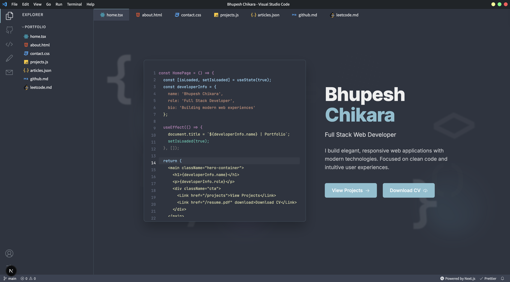

# 🚀 VSCode Portfolio

A **Visual Studio Code-themed** developer portfolio website built using **Next.js**, designed to showcase your skills, projects, and experience in a sleek, code-editor-like interface. Deployed effortlessly with **Vercel**.



---

## 🔧 Features

- Fully responsive and fast ⚡
- Multiple themes:
  - ✅ GitHub Dark (default)
  - ✅ Dracula
  - ✅ Ayu
  - ✅ Nord
  - ⏳ One Dark Pro (coming soon)
- Interactive layout with sidebar, tabs, and terminal
- Easy customization with clean and modular code
- Supports Markdown and Dev.to integration

---

## 📅 Roadmap

- [x] Multiple theme support
- [ ] One Dark Pro theme
- [ ] Interactive custom terminal
- [ ] Live blog integration via RSS

---

## 🧠 Getting Started

### 1. **Clone the repository**

```bash
git clone https://github.com/your-username/bchikara-portfolio.git
cd bchikara-portfolio
```

### 2. **Install dependencies**

```bash
npm install
# or
yarn install
```

### 3. **Start the development server**

```bash
npm run dev
# or
yarn dev
```

Visit `http://localhost:3000` to view your portfolio locally.

---

## ⚙️ Customization

- Modify the content of your portfolio in the `pages/` directory.
- Update the layout and components inside the `components/` folder.
- To add or remove tabs/pages, edit:
  - `components/Sidebar.jsx`
  - `components/Tabsbar.jsx`

---

## 🛠 Environment Variables

To fetch blog posts from [Dev.to](https://dev.to), create a `.env.local` file in the project root.

Refer to `.env.local.example` for variable names and structure.

---

## 📦 Deployment

Deploy instantly with [Vercel](https://vercel.com), the platform built by the creators of Next.js.

- Click below to deploy:

  [](https://vercel.com/new?utm_source=github&utm_medium=readme&utm_campaign=next-template)

---

## 📚 Resources

- [Next.js Documentation](https://nextjs.org/docs)
- [Learn Next.js](https://nextjs.org/learn)
- [Next.js GitHub](https://github.com/vercel/next.js)

---

## 🧑‍💻 License

MIT License © [Your Name]
